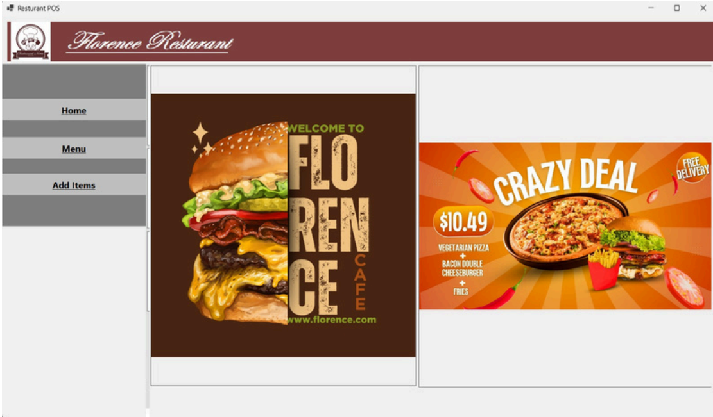
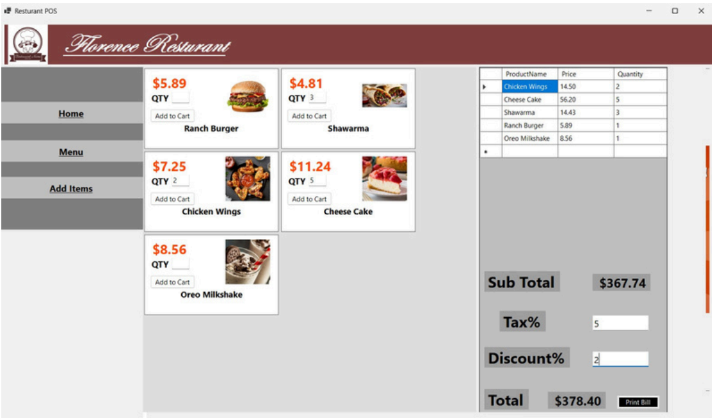
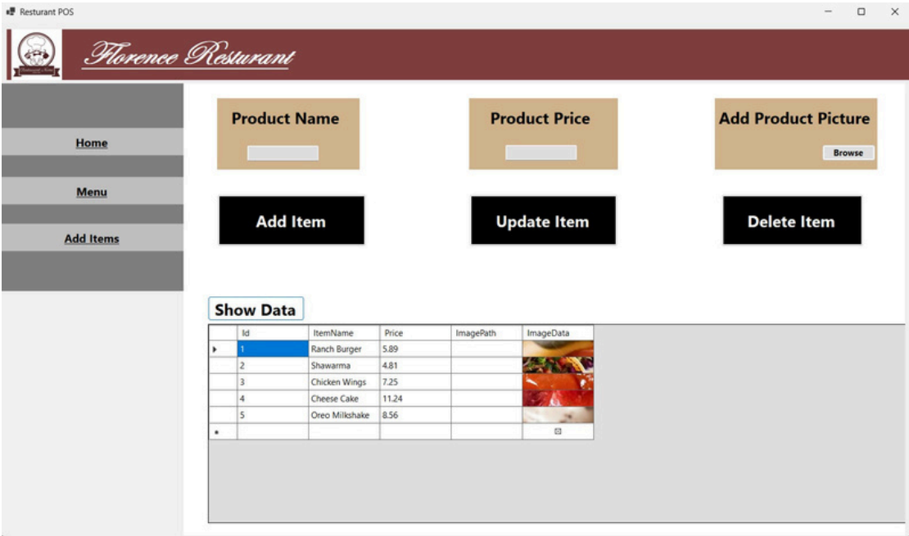
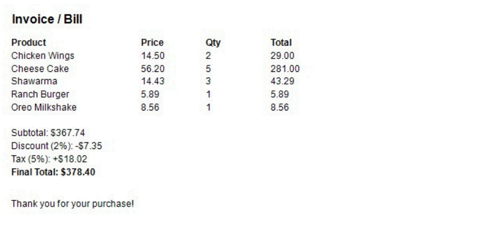

# 🛒 POS Transaction System

A desktop-based Point of Sale (POS) Transaction System developed using C# Windows Forms to simplify retail operations. The application enables efficient product management, order processing, bill generation, and invoice creation through an intuitive graphical interface.

## ✨ Key Features

- Product Management
- Billing & Order Processing
- Invoice Generation
- Automatic Total Calculation
- User-Friendly Desktop Interface

## 🛠️ Tech Stack

| Technology | Purpose |
|------------|---------|
| C# | Programming Language |
| Windows Forms | Desktop GUI |
| .NET | Application Framework |
| Visual Studio | Development Environment |

## 📷 Application Preview

### Home Dashboard



### Billing & Menu Order Screen



### Product Management



### Invoice View



## 🚀 Getting Started

1. Clone the repository.
2. Open the solution in Visual Studio.
3. Build the project.
4. Run the application.

## 📂 Project Structure

```text
POS-Transaction-System
├── WinFormsApp5
├── Properties
├── screenshots
├── README.md
└── WinFormsApp5.csproj
```

## 🎯 Project Objective

The objective of this project is to provide a simple desktop-based POS solution that demonstrates Object-Oriented Programming concepts, Windows Forms development, and desktop application design.

## 👩‍💻 Author

**Fizzah Ahmed**

Computer Science Student | 4th Semester
